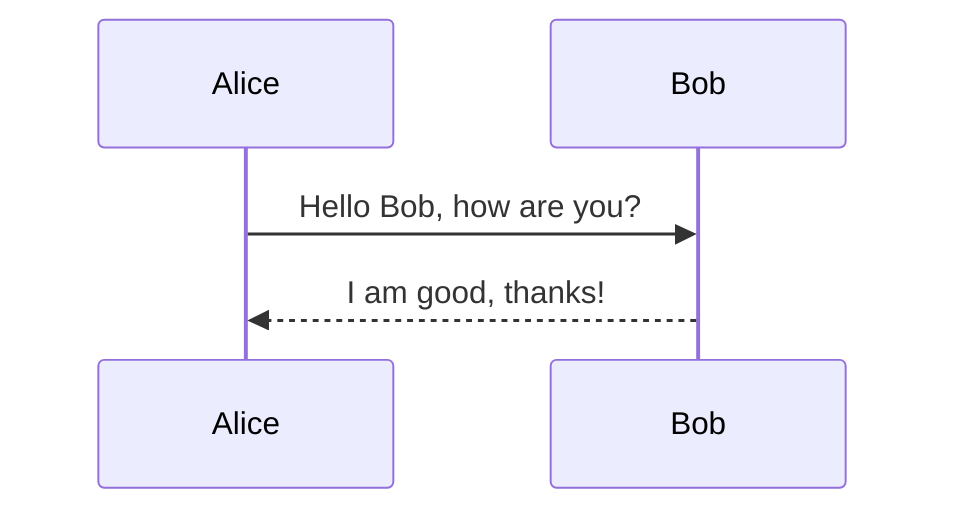

Discord uses a version of Markdown for formatting text in messages. Here are the basics:

1. **Bold**: Wrap text with two asterisks `**text**` to make it **bold**.
2. *Italic*: Wrap text with one asterisk `*text*` or an underscore `_text_` to make it *italic*.
3. __Underline__: Wrap text with two underscores `__text__` to underline it.
4. ~~Strikethrough~~: Wrap text with two tildes `~~text~~` to strike it through.
5. `Code`: Use a single backtick around text `` `text` `` for inline code formatting.
6. ```Code Blocks```: Use three backticks ``` ```text``` ``` or three tildes ```~~~text~~~``` for multiline code blocks. You can also specify a language for syntax highlighting, like ``` ```python``` for Python code.
7. > Blockquotes: Start a line with a `>` for blockquotes.
8. Lists: Use dashes `- item` or asterisks `* item` for unordered lists and numbers for ordered lists.
9. **Bold and Italic**: Combine formatting like `***text***` for bold and italic.
10. Hyperlinks: Use `[title](https://www.link.com)` to create a clickable hyperlink.
11. Spoiler: Wrap text with double vertical bars `||text||` to hide it as a spoiler.

GitLab uses Markdown for formatting text across various parts of its interface including issues, merge requests, comments, and more. Here’s a breakdown of the common Markdown syntax supported by GitLab, along with some GitLab-specific enhancements:

### Basic Formatting:
1. **Bold**: `**bold**` or `__bold__`
2. *Italic*: `*italic*` or `_italic_`
3. ~~Strikethrough~~: `~~strikethrough~~`
4. `Inline code`: Use single backticks: `` `code` ``
5. ```Code blocks```: Use triple backticks or indents:
   ````
   ```language
   code
   ```
   ````
   or
   ```
       code (4 space indent)
   ```

### Headings:
Prefix text with `#` up to `######` for headings from H1 to H6.

### Lists:
- Unordered list: `-` or `*`
- Ordered list: `1.` `2.` etc.
- Nested lists: Indent by two spaces or a tab.

### Links and Images:
- Links: `[title](https://www.url.com)`
- Images: ``

### Tables:
Create tables using dashes (`-`) for headers and pipes (`|`) for columns:
```
| Header 1 | Header 2 |
|----------|----------|
| Row 1    | Data     |
| Row 2    | Data     |
```

### Blockquotes:
Use `>` for block quotes:
```
> This is a blockquote.
```

### Task Lists:
Create task lists with dashes and brackets:
```
- [x] Completed task
- [ ] Incomplete task
```

### Special GitLab Features:
- **Mermaid Diagrams**: Use triple backticks with `mermaid` keyword to render diagrams:
  ````
  ```mermaid
  graph LR;
    A-->B;
  ```
  ````
- **Math Expressions**: Wrap LaTeX expressions between `$$` for block, or `$` for inline:
  ```
  Inline: $E=mc^2$
  Block:
  $$
  E=mc^2
  $$
  ```

GitLab Markdown also supports automatic linking for issue numbers, user mentions (`@username`), and more, which helps in integrating with GitLab's project management features. GitLab Markdown supports several advanced features that enhance its functionality, especially in the context of project management and documentation. Here’s a more detailed look at some of these useful features:

### Automatic Linking
GitLab automatically converts references to merge requests, issues, and commits within a repository into links. This allows users to quickly navigate related project documents.
- **Issues**: Use `#1` to link to issue number 1.
- **Merge Requests**: Use `!1` to link to merge request number 1.
- **Commits**: Use a commit's SHA hash, and it will automatically link to that commit.

### User Mentions
- **Mentions**: Mention a user with `@username`, and they will receive a notification. This is useful for drawing attention or assigning tasks.

### Emoji
- GitLab supports emoji shortcodes, which you can use to add visual cues and emotional expressions to your text. Type `:emoji_name:` to add an emoji. For example, `:smile:` will render a smiley face.

### Collapsible Sections
GitLab Markdown allows you to create collapsible sections, which are useful for hiding large blocks of information that users can expand if they choose.
```markdown
<details>
<summary>Click to expand!</summary>
This is a detailed explanation hidden inside a collapsible section.
</details>
```

### Including External Images and Videos
- You can embed images using `` and even videos from supported platforms by simply pasting the video URL directly into the Markdown content.

### Custom Badges
- GitLab allows the addition of custom badges to project READMEs, which can display dynamic information like build statuses or test coverage. They're defined in the project settings and use URLs to fetch images or data.

### Charts with Mermaid
- GitLab supports Mermaid diagrams, a feature that allows you to create diagrams and visualizations using text and code. This is especially useful for workflows, sequence diagrams, class diagrams, and other graphical representations directly in your documentation:


### Mathematical Expressions
- You can include mathematical expressions using LaTeX syntax, which is particularly useful for technical and scientific documentation:
```markdown
Inline math: $E=mc^2$

Block math:
$$
\begin{align}
\nabla \times \vec{\mathbf{B}} - \frac {1}{c} \frac{\partial \vec{\mathbf{E}}}{\partial t} & = \frac {4\pi}{c} \vec{\mathbf{j}} \\
\nabla \cdot \vec{\mathbf{E}} & = 4 \pi \rho \\
\nabla \times \vec{\mathbf{E}}+ \frac {1}{c} \frac{\partial \vec{\mathbf{B}}}{\partial t} & = \vec{\mathbf{0}} \\
\nabla \cdot \vec{\mathbf{B}} & = 0
\end{align}
$$
```

These features make GitLab's Markdown a powerful tool for documentation, project tracking, and enhancing communication within a team.

In GitLab Flavored Markdown, you can use a wide range of emojis, similar to those used in GitHub. These icons are part of the standard emoji set that can be included in markdown files, comments, and other text fields within GitLab by using the corresponding emoji shortcode, which is typically wrapped in colons.

### More Commonly Used Icons in GitLab Markdown:
- **Check Mark (`:white_check_mark:`)** - Used to indicate completion or approval.
- **X Mark (`:x:`)** - Indicates something is incorrect or to be removed.
- **Thumbs Up (`:thumbsup:`)** - Shows approval or agreement.
- **Thumbs Down (`:thumbsdown:`)** - Shows disapproval or disagreement.
- **Exclamation (`:exclamation:`)** - Used to highlight caution or important points.

### Adding Custom Emojis:
If you find the available emojis insufficient, GitLab allows you to add custom emojis to your instance. Here’s how you can do it:

1. **Upload Custom Emoji:**
   - Go to the admin area (you need admin rights).
   - Under the **Custom Emoji** section, you can upload new emojis.
   - Provide a name for the emoji which will be used as the shortcode wrapped in colons.

2. **Use in Markdown:**
   - Once uploaded, these custom emojis can be used anywhere in your markdown by typing `:your_custom_emoji_name:`.

Adding custom emojis allows for a more personalized and expressive way of communicating within your projects and documentation in GitLab.

Certainly! Here’s a more extensive list of commonly used emojis in GitLab Flavored Markdown, which you can use to enhance communication and documentation:

### General Emojis
- **Heart (`:heart:`)** - Express affection or emphasize liking something.
- **Fire (`:fire:`)** - Denote something as exciting, excellent, or intense.
- **Star (`:star:`)** - Highlight standout items or star features.
- **Clap (`:clap:`)** - Show applause or congratulations.
- **Eyes (`:eyes:`)** - Indicate something needs attention or scrutiny.

### Task and Status Related
- **Checkered Flag (`:checkered_flag:`)** - Mark completion or end of a process.
- **Rocket (`:rocket:`)** - Use for launches or fast developments.
- **Construction (`:construction:`)** - Show that something is under construction or in development.
- **Lock (`:lock:`)** - Indicate something is secure or access is restricted.
- **Alarm Clock (`:alarm_clock:`)** - Note deadlines or important times.

### Emotion and Feedback
- **Smile (`:smile:`)** - Express happiness or satisfaction.
- **Sad (`:sad:`)** - Show disappointment or sadness.
- **Angry (`:angry:`)** - Express frustration or anger.
- **Confused (`:confused:`)** - Indicate puzzlement or a need for clarification.

### Symbols and Signs
- **Plus (`:heavy_plus_sign:`)** - Suggest addition or inclusion.
- **Minus (`:heavy_minus_sign:`)** - Suggest deletion or exclusion.
- **Infinity (`:infinity:`)** - Denote limitless possibilities or ongoing processes.

### Fun and Miscellaneous
- **Party Popper (`:tada:`)** - Celebrate achievements or milestones.
- **Pizza (`:pizza:`)** - Often used humorously to suggest team lunches or rewards.
- **Ghost (`:ghost:`)** - For fun or to denote hidden features or easter eggs in discussions.

These emojis add visual interest and can convey emotions or statuses quickly, making communication more engaging and effective in GitLab.

# Project Overview :rocket:

Welcome to the Project X repository! :heart:

## Current Status :construction:
- **Backend Development** :hammer_and_wrench: - In progress :hourglass_flowing_sand:
- **Frontend Development** :computer: - Completed :white_check_mark:
- **Security Checks** :lock: - Pending review :mag:
- **Deployment** :rocket: - Scheduled for next week :calendar:

## Team :busts_in_silhouette:
- Alice :woman: - Lead Developer
- Bob :man: - UX/UI Designer
- Charlie :man_technologist: - DevOps Engineer

## Getting Started :bulb:
To get started with this project, please follow the setup instructions below:
1. Clone the repository :arrow_down:
    ```bash
    git clone https://example.gitlab.com/project-x.git
    ```
2. Install dependencies :wrench:
    ```bash
    npm install
    ```
3. Start the development server :fire:
    ```bash
    npm start
    ```

## Contribution Guidelines :memo:
We welcome contributions from everyone. Before contributing, please read our Contribution Guidelines :book:. Make sure to check our open issues :eyes: and pull requests :arrow_right_hook: to avoid duplication.

- To fix a bug or enhance an existing module, follow these steps:
  1. Fork the repository :fork_and_knife:
  2. Create your feature branch (`git checkout -b feature-xyz`)
  3. Commit your changes (`git commit -am 'Add some xyz'`)
  4. Push to the branch (`git push origin feature-xyz`)
  5. Create a new Pull Request :arrow_right:

## Celebrate Success :tada:
When a major feature is released, don't forget to celebrate your hard work and success! :party_popper:

## Feedback :speech_balloon:
Your feedback is very important to us. If you have any questions or comments, please don't hesitate to contact us :email: or leave a comment in the relevant issue :memo:.

Thank you for visiting our project! :stars:

